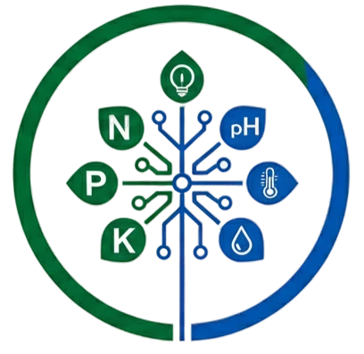

<p align="center">
  
</p>

<h1 align="center">🌱 AgroTree — Sistem Rekomendasi Tanaman Cerdas</h1>

<p align="center">
  <strong>Prediksi tanaman terbaik untuk lahan Anda menggunakan AI Decision Tree</strong>
</p>

<p align="center">
  
  
  
  
  
</p>

---

## 📋 Deskripsi

**AgroTree** adalah aplikasi web full-stack yang memanfaatkan algoritma **Decision Tree** untuk merekomendasikan tanaman terbaik berdasarkan kondisi tanah dan iklim lahan pengguna. Cukup input data **Nitrogen (N), Fosfor (P), Kalium (K), Suhu, Kelembaban, pH, dan Curah Hujan**, maka sistem akan memberikan **5 rekomendasi tanaman** paling optimal dalam hitungan milidetik.

### ✨ Fitur Utama

| Fitur | Deskripsi |
|---|---|
| 🤖 **AI Prediction** | Prediksi 5 tanaman terbaik beserta tingkat akurasi/probabilitasnya |
| 💬 **AI Chatbot** | Asisten pertanian pintar berbasis Gemini AI untuk konsultasi hama, penanaman, dll. |
| 📚 **Ensiklopedia Tanaman** | 22+ profil komoditas pangan dengan data kondisi ideal (NPK, pH, suhu, curah hujan) |
| 📊 **Dashboard Analytics** | Visualisasi riwayat prediksi menggunakan Chart.js |
| 🔐 **Autentikasi JWT** | Sistem login/register aman dengan password hashing (bcrypt) |
| 🛡️ **Enterprise Security** | Rate limiting, Helmet, CORS lock, input validation, audit log |
| ⚡ **MLOps Pipeline** | Hot-reload model tanpa downtime, versioning, dan registry otomatis |
| 🌤️ **Widget Cuaca** | Informasi cuaca real-time berdasarkan lokasi pengguna |

---

## 🏗️ Arsitektur Teknologi

```
Prediksi-Tanaman/
├── backend/                  # Go (Fiber v2) REST API Server
│   ├── main.go               # Entry point + routing + middleware
│   ├── config/               # Konfigurasi aplikasi (port, JWT, API keys)
│   ├── database/             # SQLite + WAL mode + auto-migration
│   ├── handlers/             # Handler API (auth, predict, plant, chat)
│   ├── middleware/           # JWT auth middleware
│   ├── chatbot/              # Gemini AI chatbot engine
│   ├── ml/                   # Machine Learning pipeline
│   │   ├── decision_tree.go  # Implementasi Decision Tree dari nol (pure Go)
│   │   ├── train.go          # Training pipeline + cross-validation
│   │   ├── registry.go       # MLOps registry + hot-reload watcher
│   │   ├── dataset.go        # CSV data loader
│   │   └── models/           # Trained model files (.json)
│   ├── models/               # Data structures (Go structs)
│   └── data/                 # SQLite database + plant info (plants.json)
│
├── frontend/                 # React 19 + Vite 7 SPA
│   ├── src/
│   │   ├── pages/            # Halaman (Landing, Dashboard, Predict, Plants, dll.)
│   │   ├── components/       # Komponen reusable (Layout, WeatherWidget, dll.)
│   │   ├── services/         # API client (fetch wrapper)
│   │   └── index.css         # Styling lengkap (CSS murni, tanpa framework)
│   └── public/assets/        # Logo, gambar showcase, avatar
│
└── ml/                       # Dataset asli + skrip training Python (opsional)
    ├── dataset/
    │   └── crop_recommendation.csv   # 2200 sampel, 22 kelas tanaman
    └── train_model.py        # Training alternatif (Python/sklearn)
```

---

## 🚀 Cara Setup & Menjalankan di Lokal

### Prasyarat (Prerequisites)

| Software | Versi Minimum | Link Download |
|---|---|---|
| **Go** | 1.21+ | [golang.org/dl](https://golang.org/dl/) |
| **Node.js** | 18+ | [nodejs.org](https://nodejs.org/) |
| **Git** | Terbaru | [git-scm.com](https://git-scm.com/) |

> **Catatan:** Python opsional, hanya diperlukan jika ingin menjalankan training model via `train_model.py`.

---

### Langkah 1: Clone Repository

```bash
git clone https://github.com/<username>/Prediksi-Tanaman.git
cd Prediksi-Tanaman
```

---

### Langkah 2: Setup Backend (Go API Server)

```bash
# Masuk ke direktori backend
cd backend

# Download dependensi Go
go mod tidy

# Training model ML (WAJIB untuk pertama kali)
go run main.go train

# Jalankan server backend (port 8088)
go run main.go
```

Jika berhasil, Anda akan melihat output:
```
✅ Initial active model loaded successfully into memory.
Loaded info for 22 plants
🌱 TanamanAI server starting on http://localhost:8088
```

> **Tips:** Anda juga bisa build binary terlebih dahulu:
> ```bash
> go build -o prediksi-tanaman.exe
> ./prediksi-tanaman.exe
> ```

---

### Langkah 3: Setup Frontend (React + Vite)

Buka terminal **baru** (jangan tutup terminal backend):

```bash
# Masuk ke direktori frontend
cd frontend

# Install dependensi Node.js
npm install

# Jalankan development server (port 3000)
npm run dev
```

Jika berhasil, Anda akan melihat:
```
  VITE v7.x.x  ready in xxx ms

  ➜  Local:   http://localhost:3000/
```

---

### Langkah 4: Akses Aplikasi

Buka browser dan navigasi ke: **http://localhost:3000**

1. Klik **"Mulai Gratis"** untuk membuat akun baru
2. Login dengan akun yang sudah dibuat
3. Mulai prediksi tanaman di halaman **Dashboard → Prediksi**

---

## 🧠 Tutorial Training Model ML (Manual)

AgroTree menggunakan algoritma **Decision Tree** yang diimplementasikan dari nol menggunakan bahasa Go (*pure Go, tanpa library ML eksternal*).

### Metode 1: Training via Go (Direkomendasikan)

```bash
cd backend

# Training dengan dataset default
go run main.go train

# Training dengan dataset kustom
go run main.go train /path/to/custom_dataset.csv

# Training dengan output registry kustom
go run main.go train /path/to/dataset.csv /path/to/registry.json
```

**Output yang dihasilkan:**
```
Loading data from ../ml/dataset/crop_recommendation.csv...
Loaded 2200 samples with 7 features
Features: [N P K temperature humidity ph rainfall]
Classes (22): [rice maize chickpea kidneybeans ...]

--- Running 5-Fold Cross Validation ---
Fold 1: 98.18%
Fold 2: 97.95%
Fold 3: 98.64%
Fold 4: 97.95%
Fold 5: 99.09%
>> Mean True CV Accuracy: 98.36%

--- Training Final Production Model ---
Train: 1540, Validation: 330, Test: 330 samples
Training Accuracy:   95.78%
Validation Accuracy: 95.15%
Final Test Accuracy: 93.64%

Classification Report (Test Set):
                      precision     recall   f1-score    support
------------------------------------------------------------
apple                      1.00       1.00       1.00         12
banana                     1.00       1.00       1.00         20
...

Saving MLOps Version [v_1771940173] to ml/models/model_v_1771940173.json...
MLOps Deployment Registry Updated! Done!
```

### Metode 2: Training via Python (Opsional/Alternatif)

```bash
cd ml

# Install dependensi Python
pip install scikit-learn pandas numpy

# Jalankan training
python train_model.py
```

> **Catatan:** Model Python (`.pkl`) TIDAK digunakan oleh backend Go. Ini hanya untuk perbandingan/eksperimen.

---

### 🔄 Hot-Reload Model (Zero Downtime)

AgroTree mendukung **hot-reload**: ketika model baru selesai ditraining, server yang sedang berjalan akan **otomatis** mendeteksi perubahan pada `ml/registry.json` dan memuat model terbaru tanpa restart.

```bash
# Terminal 1: Server berjalan
go run main.go

# Terminal 2: Training model baru (server akan auto-reload)
go run main.go train
```

Server log akan menampilkan:
```
🔄 Detected new model deployment in registry.json! Hot reloading...
✅ Hot reload successful! New production model is now answering predicting requests.
```

---

## 🔧 Konfigurasi Environment

Backend dapat dikonfigurasi via environment variables:

| Variable | Default | Deskripsi |
|---|---|---|
| `PORT` | `8088` | Port backend server |
| `JWT_SECRET` | (built-in dev key) | Secret key untuk JWT token |
| `GEMINI_API_KEY` | (built-in dev key) | API key Google Gemini untuk chatbot |
| `ALLOWED_ORIGINS` | `http://localhost:5173,http://localhost:5175` | CORS whitelist |

**Contoh penggunaan:**
```bash
# Windows (PowerShell)
$env:PORT="9090"; $env:JWT_SECRET="my-super-secret"; go run main.go

# Linux/macOS
PORT=9090 JWT_SECRET=my-super-secret go run main.go
```

---

## 📡 API Endpoints

| Method | Endpoint | Auth | Deskripsi |
|---|---|---|---|
| `GET` | `/api/health` | ❌ | Health check server + status ML |
| `POST` | `/api/auth/register` | ❌ | Registrasi akun baru |
| `POST` | `/api/auth/login` | ❌ | Login (mengembalikan JWT token) |
| `GET` | `/api/auth/me` | ✅ | Profil user yang sedang login |
| `PUT` | `/api/auth/name` | ✅ | Update nama user |
| `PUT` | `/api/auth/password` | ✅ | Ganti password |
| `PUT` | `/api/auth/avatar` | ✅ | Update avatar (preset) |
| `POST` | `/api/auth/avatar/upload` | ✅ | Upload avatar kustom |
| `GET` | `/api/plants` | ❌ | Daftar semua 22 tanaman (dengan ETag cache) |
| `GET` | `/api/plants/:name` | ❌ | Detail satu tanaman |
| `POST` | `/api/predict` | ✅ | Prediksi rekomendasi tanaman |
| `GET` | `/api/predictions` | ✅ | Riwayat prediksi user |
| `GET` | `/api/predictions/stats` | ✅ | Statistik prediksi user |
| `DELETE` | `/api/predictions/:id` | ✅ | Hapus satu riwayat prediksi |
| `POST` | `/api/chat` | ✅ | Kirim pesan ke AI chatbot |
| `GET` | `/api/chat/history` | ✅ | Riwayat chat user |
| `DELETE` | `/api/chat/history` | ✅ | Hapus semua riwayat chat |

---

## 📂 Dataset

Dataset yang digunakan: **[Crop Recommendation Dataset](https://www.kaggle.com/datasets/atharvaingle/crop-recommendation-dataset)** dari Kaggle.

- **2200 sampel** dengan **7 fitur** input
- **22 kelas** tanaman output
- Fitur: `N` (Nitrogen), `P` (Fosfor), `K` (Kalium), `temperature`, `humidity`, `ph`, `rainfall`

---

## 🛡️ Fitur Keamanan

- ✅ **Bcrypt** password hashing (cost factor 12)
- ✅ **JWT** authentication dengan expiry 24 jam
- ✅ **Rate Limiting** — 120 req/min global, 10 req/min untuk login
- ✅ **Helmet** — proteksi XSS, clickjacking, MIME sniffing
- ✅ **CORS Lock** — hanya origin yang terdaftar yang bisa akses API
- ✅ **Input Validation** — semua parameter prediksi divalidasi dengan range realistis
- ✅ **Gzip Compression** — hemat bandwidth 60-80%
- ✅ **Request ID Tracing** — setiap request punya UUID unik untuk debugging
- ✅ **Graceful Shutdown** — server menyelesaikan request aktif sebelum mati
- ✅ **Context Timeout** — query database otomatis dibatalkan setelah 5 detik

---

## 📄 Lisensi

Proyek ini dibuat untuk keperluan edukasi dan riset pertanian.

---

<p align="center">
  <strong>Dibuat dengan 💚 untuk Petani Modern Indonesia</strong>
</p>
